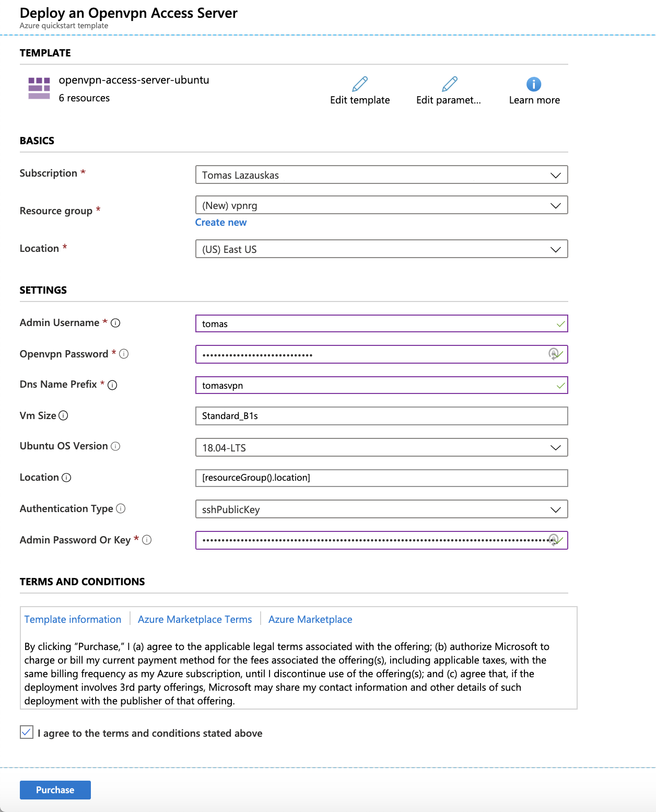
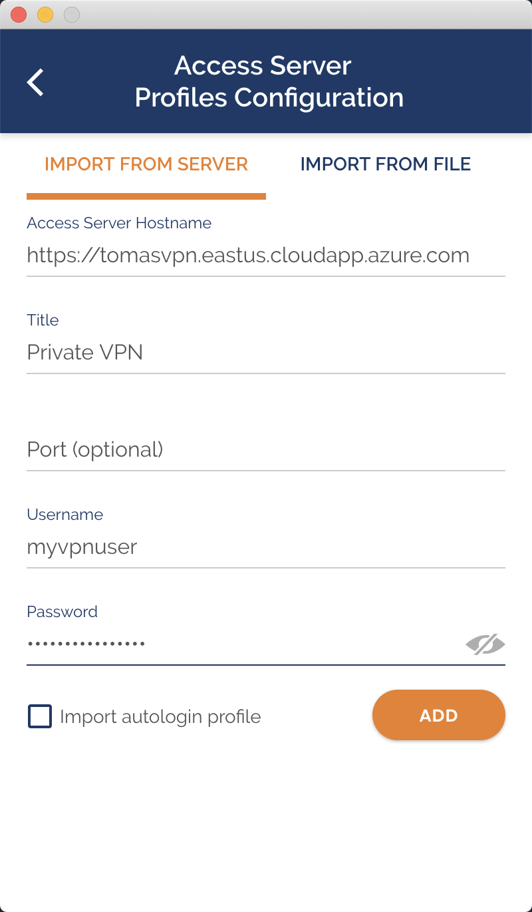

# Remote work essentials: your own VPN in minutes

The number of professionals working remotely has never been as high as nowadays. Almost all major employers support remote work at least one day a week and the Alan Turing Institute is no exception. There are many articles and studies showing various benefits, such as a better work-life balance, time and money savings, flexibility and a positive impact of changing working environment; and recently I had the opportunity to enjoy it myself.

I spent a week working remotely from Taipei City, Taiwan. I did not want to spend my work days just staying in a hotel room, programming and replying to emails - I do not need to travel so far and for so long to do that. I wanted to enjoy the new environment while working, and the solution was simple - enjoy new and trendy coffee shops while doing my work!

This meant that I had to use public or coffee shop's Wi-Fi network which might be compromised or there might be someone next to me sniffing the wireless traffic. Thus, before I put my laptop in my backpack and prepared myself to turn some of that coffee into code, I created my own VPN Server on Azure, so that I could establish secure online connections.

The process is very quick and straightforward and it takes less than 10 minutes to set it up. The amazing part is that the only thing that one needs is an active Azure subscription. To make things even easier, I used an Azure template (Deploy to Azure button) which does most of the configuration behind the scenes.

The steps are as follows:

- Click on 

- Fill in the form that was opened

    - Subscription - the subscription that the charges will be applied to (e.g. Tomas Lazauskas)
    - Resource group - is the resource group that you want to charge against (e.g. vpnrg)
    - Location - it is better to choose the closest (for speed). However, I would like servers to think that I am connecting from the US, thus I choose East US
    - Admin Username - user name for the VM (e.g. tomas)
    - Openvpn Password - a strong password for the admin user (tomas)
    - Dns Name Prefix - a unique prefix for the dns name (e.g. tomasvpn)
    - Vm Size - Standard_B1s is sufficient enough and costs about $0.30 a day
    - Ubuntu OS Version - 18.04-LTS
    - Location - keep it as it is
    - Authentication Type - sshPublicKey (recommended)
    - Admin Password Or Key - paste the public key that should be used for connection
- Check "I agree to the terms and conditions stated above" and click on "Purchase".

When the deployment is finished, the VPN server can be accessed via a browser by typing https://, pasting the DNS name of your newly created virtual machine and adding /admin to the end, e.g. https://tomasvpn.eastus.cloudapp.azure.com/admin

(If you get an SSL error, just ignore it and proceed to the website.)

Next thing to do is to login to the newly built VPN server (username: **openvpn**, password: the value that you have used for Openvpn Password in the form) and finalise the set up:

1. Specify the public ip address of your VPN server

  Go to CONFIGURATION->Network Settings, change "Hostname or IP Address:" to your VM public IP address and click "Save Settings" at the bottom of the page.

2. Add a user account

  Go to USER MANAGEMENT->User Permissions, add a new user (for example "myvpnuser"), click on more settings, select "Allow Auto-login" and set a password for it. Click "Save Settings" at the bottom of the page. This will be your user account that can be used to connect to the VPN server.

That is it on the server side of things - it is time to install client software on the device(s) the VPN will be used.

On your device open https://< DNS name > of the VM (e.g. https://tomasvpn.eastus.cloudapp.azure.com), sign in with your user credentials (from the previous section) and it will suggest a client compatible with your device's operating system.

Download the suggested client and add your server details with the user account.

Couple of things to note:
  - the free OpenVPN server version allows only two free simultaneous VPN connections (perfect for a laptop/smartphone combination),
  - the free trial doesn't expire.

That is it, all is set up, and anytime you need a VPN service, you just need to spin up the VM on Azure and connect to it using the client.

Let's enjoy that coffee (咖啡) and do some work!
